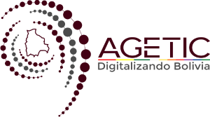

  

  <h1>Jacobitus Escritorio</h1>

## Sistema Operativo

- [Debian](README-DEBIAN.md)
- [Fedora](README-FEDORA.md)
- [Windows x64](README-WINDOWS-X64.md)
- [Windows x32](README-WINDOWS-X32.md)
- [MacOS procesador Intel](README-MACOS-X64.md)
- [MacOS procesador Apple](README-MACOS-ARM64.md)

## Licencia

[LICENCIA PÚBLICA GENERAL](LICENSE.md) 
de Consideraciones y Registro de Software Libre en Bolivia (LPG-Bolivia)
